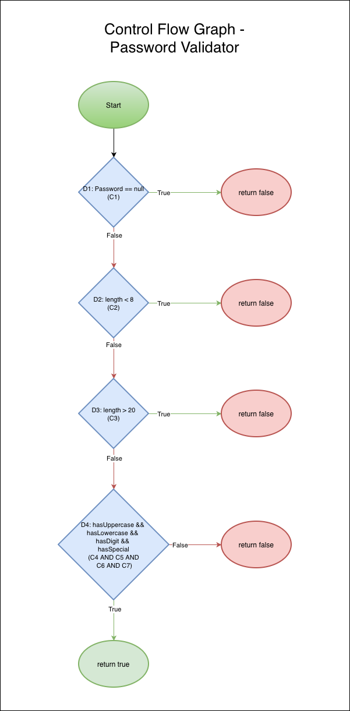

# TSS Proiect laborator

## Validator de Parolă

## Alexe Vasile Paul, Grupa 505 (BDTS)

### Descrierea Proiectului

Acest proiect implementează un validator de parolă care verifică dacă o parolă introdusă de utilizator respectă anumite criterii de securitate. Acesta primește un string, reprezentând parola, și returnează un `boolean` care reprezintă dacă parola este validă sau nu.

### Input

Input-ul este un șir de caractere `string`. Validatorul primește o singură intrare: parola introdusă de utilizator, reprezentată ca un `string`.

### Output

Output-ul este un boolean `true/false`. Validatorul returnează `true` dacă parola este validă conform criteriilor specificate și `false` în caz contrar.

### Criterii de Validare

Parola este considerată validă dacă îndeplinește următoarele condiții:

1. Parola nu trebuie să fie `null`
2. Lungimea parolei trebuie să fie intre 8 și 20 de caractere (inclusiv) `8 <= length <= 20`
3. Parola trebuie să conțină:
   - cel puțin o literă mare `[A-Z]`
   - cel puțin o literă mică `[a-z]`
   - cel puțin o cifră `[0-9]`
   - cel puțin un caracter special `[!@#$%^&*]`

### Cerinta 1: Generarea datelor de test

#### a) Equivalence Partitioning

Pentru a testa validatorul de parolă, am identificat următoarele partiții de echivalență (EP):


| ID  | Parolă                    | Partiție acoperită          | Rezultat așteptat |
| --- | -------------------------- | ----------------------------- | ------------------ |
| EP1 | null                       | EP1 (parolă null)            | false              |
| EP2 | "Ab1!"                     | EP2 (lungime < 8)             | false              |
| EP3 | "Ab1!abcdabcdabcdabcdabcd" | EP3 (lungime > 20)            | false              |
| EP4 | "ab1!abcd"                 | EP4 (fără literă mare)     | false              |
| EP5 | "AB1!ABCD"                 | EP5 (fără literă mică)    | false              |
| EP6 | "Abc!abcd"                 | EP6 (fără cifră)           | false              |
| EP7 | "Ab1abcdE"                 | EP7 (fără caracter special) | false              |
| EP8 | "Ab1!abcd"                 | EP8 (toate valide)            | true               |

Fiecare partiție de echivalență a fost reprezentată printr-un singur caz de test, presupunând că toate valorile din aceeași clasă sunt tratate identic de către program.

Fiecare caz de test din tabelul de mai sus va fi implementat în clasa [PasswordValidatorEPTest](./PasswordValidator/src/test/java/validator/PasswordValidatorEPTest.java) folosind JUnit.

#### b) Boundary Value Analysis

Boundary Value Analysis testează valorile de la limitele intervalului de intrare, deoarece acestea sunt punctele critice unde apar cele mai multe erori.

Criteriu testat: lungimea parolei este intre 8 si 20 de caractere (inclusiv). `8 <= length <= 20`


| Test ID | Parolă exemplu         | Lungime | Rezultat |
| ------- | ----------------------- | ------- | -------- |
| BVA1    | "Ab1!abc"               | 7       | false    |
| BVA2    | "Ab1!abcd"              | 8       | true     |
| BVA3    | "Ab1!abcde"             | 9       | true     |
| BVA4    | "Ab1!abcdefghijklmno"   | 19      | true     |
| BVA5    | "Ab1!abcdefghijklmnop"  | 20      | true     |
| BVA6    | "Ab1!abcdefghijklmnopq" | 21      | false    |

Toate celelalte condiții (litere, cifre, caractere speciale) sunt respectate în aceste exemple, pentru a testa strict limita lungimii parolei.

Fiecare caz de test din tabelul de mai sus va fi implementat în clasa [PasswordValidatorBVATest](./PasswordValidator/src/test/java/validator/PasswordValidatorBVATest.java) folosind JUnit.

#### c) Cause–Effect Graphing

Cause–Effect Graphing se folosește pentru a transforma cerințele funcționale într-un graf logic care leagă cauzele (input-uri/condiții) de efecte (output/decizii).

- Cause (C) = condiție de intrare
- Effect (E) = rezultat așteptat

##### Cauze (input conditions)


| Cod cauză | Descriere                           |
| ---------- | ----------------------------------- |
| C1         | Parola este null                    |
| C2         | Lungimea parolei < 8                |
| C3         | Lungimea parolei > 20               |
| C4         | Parola nu conține literă mare     |
| C5         | Parola nu conține literă mică    |
| C6         | Parola nu conține cifră           |
| C7         | Parola nu conține caracter special |

##### Efect (output)


| Cod efect | Descriere                     |
| --------- | ----------------------------- |
| E1        | Parola este invalidă (false) |
| E2        | Parola este validă (true)    |

##### Tabel de decizie


| Test ID | C1 | C2 | C3 | C4 | C5 | C6 | C7 | E1 (false) | E2 (true) | Parolă exemplu             |
| ------- | -- | -- | -- | -- | -- | -- | -- | ---------- | --------- | --------------------------- |
| CE1     | 1  | 0  | 0  | 0  | 0  | 0  | 0  | 1          | 0         | null                        |
| CE2     | 0  | 1  | 0  | 0  | 0  | 0  | 0  | 1          | 0         | "Ab1!a"                     |
| CE3     | 0  | 0  | 1  | 0  | 0  | 0  | 0  | 1          | 0         | "Ab1!abcdefghijklmnopqrstu" |
| CE4     | 0  | 0  | 0  | 1  | 0  | 0  | 0  | 1          | 0         | "ab1!abcd"                  |
| CE5     | 0  | 0  | 0  | 0  | 1  | 0  | 0  | 1          | 0         | "AB1!ABCD"                  |
| CE6     | 0  | 0  | 0  | 0  | 0  | 1  | 0  | 1          | 0         | "Abc!abcd"                  |
| CE7     | 0  | 0  | 0  | 0  | 0  | 0  | 1  | 1          | 0         | "Ab1abcdE"                  |
| CE8     | 0  | 0  | 0  | 0  | 0  | 0  | 0  | 0          | 1         | "Ab1!abcd"                  |

Fiecare caz de test din tabelul de mai sus va fi implementat în clasa [PasswordValidatorCETest](./PasswordValidator/src/test/java/validator/PasswordValidatorCEGTest.java) folosind JUnit.

### Cerinta 2: Calcularea acoperirii testelor si comentarea rezultatelor

#### a) Calcularea acoperirii testelor


| Set Teste | Instructions Covered | % Instructions | Branches Covered | % Branches | Lines Covered | % Lines | Complexity Covered | % Complexity |
| --------- | -------------------- | -------------- | ---------------- | ---------- | ------------- | ------- | ------------------ | ------------ |
| EP        | 78                   | 96.3%          | 23               | 95.8%      | 21            | 95.5%   | 12                 | 85.7%        |
| BVA       | 75                   | 92.6%          | 18               | 75.0%      | 20            | 90.9%   | 7                  | 50.0%        |
| CEG       | 78                   | 96.3%          | 23               | 95.8%      | 21            | 95.5%   | 12                 | 85.7%        |

Pentru a calcula acoperirea testelor, am rulat individual fiecare fisier de test folosind comenzile:

- `mvn clean test -Dtest=PasswordValidatorEPTest -Djacoco.destFile=target/jacoco-ep.exec`
- `mvn clean test -Dtest=PasswordValidatorBVATest -Djacoco.destFile=target/jacoco-bva.exec`
- `mvn clean test -Dtest=PasswordValidatorCEGTest -Djacoco.destFile=target/jacoco-ceg.exec`

Aceste comenzi generează fișiere de execuție JaCoCo (`.exec`) pentru fiecare set de teste. Pentru a genera rapoartele de acoperire, am folosit comanda:

- `mvn jacoco:report -Djacoco.dataFile="target/jacoco-ep.exec"`
- `mvn jacoco:report -Djacoco.dataFile="target/jacoco-bva.exec"`
- `mvn jacoco:report -Djacoco.dataFile="target/jacoco-ceg.exec"`

Rapoartele de acoperire au fost generate în format HTML și pot fi găsite în directoarele:

- [./PasswordValidator/CoverageCalculations/EP/jacoco/index.html](./PasswordValidator/CoverageCalculations/EP/jacoco/index.html) - pentru Equivalence Partitioning
- [./PasswordValidator/CoverageCalculations/BVA/jacoco/index.html](./PasswordValidator/CoverageCalculations/BVA/jacoco/index.html) - pentru Boundary Value Analysis
- [./PasswordValidator/CoverageCalculations/CEG/jacoco/index.html](./PasswordValidator/CoverageCalculations/CEG/jacoco/index.html) - pentru Cause–Effect Graphing

#### b) Concluzii

Pentru aceasta aplicatie, fiind una relativ simpla, toate cele trei tehnici de testare au oferit o acoperire a instructiunilor ridicata.

Consider ca motivul pentru aceasta acoperire ridicata este faptul ca singurul mod prin care aplicatia va returna valoarea `true`, acceptand astfel o parola ca fiind valida, este daca trece prin toate liniile din codul sursa fara a returna mai devreme cu `false`.

In concluzie, in momentul in care un test are ca `input` o parola valida, va face astfel acoperirea sa fie ridicata. Fiecare set de teste contine si o parola valida, astfel ajungem in situatia in care fiecare metoda de testare are coverage aproape 100% (in cazul acestei aplicatii, motivul de ce totusi nu ajunge niciuna din cele 3 la 100% este faptul ca nu este testat constructorul clasei, metoda fiind statica).

Putem in schimb sa observam ca desi toate cele 3 metode de testare au obtinut valori mari pentru acoperirea liniilor, in cazul `BVA` aceste valori sunt putin mai mici. Acest fapt se datoreaza lipsei testarii cazului cu `password=null`, deoarece am testat doar lungimi 7, 8, 9, 19, 20, 21.
Totodata, acoperirea pentru `Branches` si `Complexity` este mai mica in cazul `BVA`, din motivul ca nu sunt testate parole care sunt invalide din cauza compozitiei, ci doar din cauza lungimii.

### Cerinta 3: Transformarea in Graf Orientat si gasirea unui set de teste care satisface criteriul MC/DC.

#### a) Transformarea programului intr-un graf orientat

In figura de mai jos este reprezentat graful orientat asociat metodei de validare a parolei. In cadrul acestui graf, nodurile ovale reprezinta punctele de Inceput si de terminare ale execuției, iar nodurile de tip romb reprezinta structurile decizionale (`if`) din program.



#### b) Ce este criteriul MC/DC?

Criteriul MC/DC (Modified Condition/Decision Coverage) este o tehnica de testare care asigura ca fiecare conditie dintr-o decizie afecteaza rezultatul deciziei in mod independent. Pentru a satisface acest criteriu, trebuie sa se demonstreze ca schimbarea unei conditii atomice din `true` in `false` (sau invers) schimba rezultatul deciziei, in timp ce toate celelalte conditii raman constante.

In cazul acestui program, singura conditie compusa este cea care verifica daca parola contine toate tipurile necesare de caractere (litere mari, litere mici, cifre, caractere speciale). Celelalte conditii sunt deja atomice.

#### c) Identificarea deciziilor si conditiilor atomice

| Decizie | Conditii                                                                       | Tip decizie |
|---------|--------------------------------------------------------------------------------|-------------|
| D1      | C1: password == null                                                           | simpla      |
| D2      | C2: length < 8                                                                 | simpla      |
| D3      | C3: length > 20                                                                | simpla      |
| D4      | C4: hasUppercase AND C5: hasLowercase <br/>AND C6: hasDigit AND C7: hasSpecial | compusa     |

#### d) Set de teste care satisface criteriul MC/DC

| Test | C4 (Upper) | C5 (Lower) | C6 (Digit) | C7 (Special) | Decizia D4 | Parolă exemplu |
|------|------------|------------|------------|--------------|------------|----------------|
| M1   | T          | T          | T          | T            | T          | Ab1!abcda      |
| M2   | F          | T          | T          | T            | F          | ab1!abcda      |
| M3   | T          | F          | T          | T            | F          | AB1!ABCDA      |
| M4   | T          | T          | F          | T            | F          | Abc!abcda      |
| M5   | T          | T          | T          | F            | F          | Ab1abcdEa      |


Pentru a satisface criteriul MC/DC pentru decizia D4, am creat cinci teste (M1-M5) care acopera toate conditiile atomice. Fiecare test schimba o singura conditie atomica, in timp ce celelalte raman constante, astfel demonstrand ca fiecare conditie afecteaza rezultatul deciziei in mod independent. Pentru a aplica criteriul MC/DC complet, presupunem criteriile pentru celelalte decizii (C1, C2, C3) ca avand valoarea de adevar `false`, astfel incat sa nu influenteze rezultatul final al validarii parolei.

##### Demonstratia Independentei Conditiilor

- Test M1: Toate conditiile sunt `true`, decizia D4 este `true`.
- Test M2: C4 este `false`, celelalte conditii sunt `true`, decizia D4 este `false`.
- Test M3: C5 este `false`, celelalte conditii sunt `true`, decizia D4 este `false`.
- Test M4: C6 este `false`, celelalte conditii sunt `true`, decizia D4 este `false`.
- Test M5: C7 este `false`, celelalte conditii sunt `true`, decizia D4 este `false`.

#### e) Implementarea testelor MC/DC

Fiecare caz de test din tabelul de mai sus va fi implementat în clasa [PasswordValidatorMCDCTest](./PasswordValidator/src/test/java/validator/PasswordValidatorMCDCTest.java) folosind JUnit.


### Cerinta 4: Identificarea unui mutant de ordinul 1 echivalent al programului

Un mutant de ordinul 1 echivalent este o versiune a programului original care a suferit o modificare. In ciuda modificării, produce aceleași rezultate pentru toate cazurile de testare existente. Acest lucru înseamnă că mutantul nu poate fi "ucis" de niciun test existent, deoarece comportamentul său rămâne identic cu cel al programului original.

#### a) Mutant Echivalent Identificat

```java
// Original
if ("!@#$%^&*".indexOf(c) >= 0) {
    hasSpecial = true;
}

// Mutant Echivalent
if ("!@#$%^&*".contains(String.valueOf(c))) {
    hasSpecial = true;
}
```
#### b) Explicația Mutantului Echivalent
În acest mutant, am înlocuit metoda `indexOf` cu metoda `contains` pentru a verifica dacă un caracter este prezent în șirul de caractere speciale. Ambele metode verifică prezența unui caracter într-un șir, dar folosesc abordări diferite de implementare.

##### De ce este echivalent acest mutant?
Comportamentul ambelor metode este identic în contextul nostru, deoarece ambele vor returna `true` dacă caracterul este găsit în șirul de caractere speciale și `false` în caz contrar. Astfel, pentru toate cazurile de testare existente, acest mutant va produce aceleași rezultate ca și programul original.

##### Tip mutatie:

Mutantul ales, prin înlocuirea metodei `indexOf` cu `contains`, este un exemplu de *SVR* (Statement/Variable Replacement), deoarece schimbă o instrucțiune fără a modifica comportamentul programului.

#### c) Implementarea Mutantului Echivalent
Implementarea acestui mutant echivalent poate fi consultată în fișierul [PasswordValidatorEquivalentMutant.java](./PasswordValidator/src/main/java/org/example/validator/PasswordValidatorEquivalentMutant.java).

### Cerinta 5: Identificarea mutantilor ne-echivalenti

Un mutant ne-echivalent este o versiune modificată a programului original care produce rezultate diferite pentru cel puțin un caz de testare existent. Acești mutanți pot fi "ucisi" de testele existente, deoarece comportamentul lor diferă de cel al programului original.

Pentru a identifica mutantii ne-echivalenti, am ales testul EP8. Test ce are ca input: `"Ab1!abcd"` si se asteapta ca output-ul sa fie `true`.

#### a) Identificarea mutantului ne-echivalent care sa fie omorat de testul EP8

##### Mutantul identificat
```java
// Original
return hasUppercase && hasLowercase && hasDigit && hasSpecial;
// Mutant Ne-echivalent
return hasUppercase && hasLowercase && hasDigit && !hasSpecial;
```

##### Explicația mutantului ne-echivalent
In cazul acestui mutant ne-echivalent, am modificat condiția care verifică prezența caracterelor speciale, schimbând `hasSpecial` în `!hasSpecial`. Aceasta înseamnă că pentru ca parola să fie considerată validă, nu trebuie să conțină caractere speciale. Testul ep8, care verifică o parolă ce conține un caracter special, va eșua pentru acest mutant, deoarece așteaptă ca parola să fie validă (`true`), dar mutantul va returna `false`. Astfel, acest mutant ne-echivalent este "ucis" de testul EP8.

##### Tip mutatie:
Mutantul ales, prin negarea condiției `hasSpecial`, este un exemplu de *LOR* (Logical Operator Replacement), deoarece schimbă parametrul unei conditii logice in cadrul unei decizii.

##### Implementarea Mutantului Ne-echivalent
Implementarea acestui mutant ne-echivalent poate fi consultată în fișierul [PasswordValidatorKilled.kava](./PasswordValidator/src/main/java/org/example/validator/PasswordValidatorKilled.java).

#### b) Identificarea mutantului ne-echivalent care sa nu fie omorat de testul EP8

```java
// Original
return hasUppercase && hasLowercase && hasDigit && hasSpecial;
// Mutant Ne-echivalent
return hasUppercase && hasLowercase && hasDigit;
```

##### Explicația mutantului ne-echivalent

In cazul acestui mutant ne-echivalent, am eliminat condiția care verifică prezența caracterelor speciale din decizia finală. Astfel, pentru ca parola să fie considerată validă, nu mai este necesar să conțină un caracter special. Testul EP8, care verifică o parolă ce conține un caracter special, va trece pentru acest mutant, deoarece așteaptă ca parola să fie validă (`true`), iar mutantul va returna `true` datorită faptului că celelalte condiții sunt îndeplinite. Astfel, acest mutant ne-echivalent nu este "ucis" de testul EP8.

##### Tip mutatie:
Mutantul ales, prin eliminarea condiției `hasSpecial`, este un exemplu de *LCR* (Logical Condition Removal), deoarece elimină o parte a deciziei.

##### Implementarea Mutantului Ne-echivalent

Implementarea acestui mutant ne-echivalent poate fi consultată în fișierul [PasswordValidatorNotKilled.java](./PasswordValidator/src/main/java/org/example/validator/PasswordValidatorNotKilled.java).